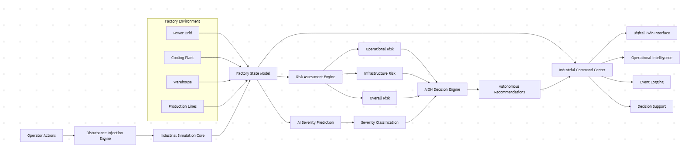

# System Architecture

## Overview

AION is an industrial operational intelligence platform that combines simulation, risk assessment, machine learning, and decision support within a unified architecture.

The system processes industrial disturbances through a simulation pipeline, evaluates their impact, predicts severity levels, and generates recommendations that are presented through a centralized Industrial Command Center.

---

## Disturbance Injection Layer

The Disturbance Injection Engine allows operators to simulate industrial events, including:

* Power Surge
* Cooling Failure
* Material Shortage
* Demand Increase
* Demand Reduction

These disturbances act as inputs to the simulation environment and enable scenario testing under different operating conditions.

---

## Factory Simulation & State Layer

The Factory Simulation Layer updates the factory's operational state in response to disturbances.

Key monitored parameters include:

* Throughput
* Thermal Load
* Power Usage
* System Health

The resulting Factory State serves as the central source of truth for all downstream analysis.

---

## Intelligence Layer

### Risk Assessment Engine

Calculates:

* Operational Risk
* Infrastructure Risk
* Overall Risk

These metrics provide a quantitative assessment of factory health and stability.

### AI Severity Prediction

A neural network built using scikit-learn's MLPClassifier analyzes the current factory state and predicts:

* NORMAL
* WARNING
* CRITICAL

along with a confidence score.

Together, these components transform operational data into actionable intelligence.

---

## Decision Layer

The AION Decision Engine combines risk metrics and AI predictions to generate operational recommendations.

This layer provides decision support by helping operators understand potential impacts and prioritize responses.

---

## Industrial Command Center

The Command Center acts as the system's operational interface.

It consolidates:

* Digital Twin Visualization
* Risk Metrics
* Severity Predictions
* Recommendations
* Confidence Scores
* Operations Logs

into a single real-time dashboard.

---

## System Workflow

```text
Operator Input
        ↓
Disturbance Injection
        ↓
Factory Simulation
        ↓
Factory State Update
        ↓
Risk Assessment
        ↓
AI Severity Prediction
        ↓
Decision Engine
        ↓
Recommendation Generation
        ↓
Industrial Command Center
```

---

## Architectural Significance

Unlike traditional monitoring dashboards that focus on reporting current conditions, AION combines simulation, risk evaluation, AI-based prediction, and decision support within a single platform.

This enables operators not only to observe industrial systems, but also to understand potential consequences, evaluate risks, and make more informed decisions—representing a foundational step toward future autonomous industrial orchestration systems.